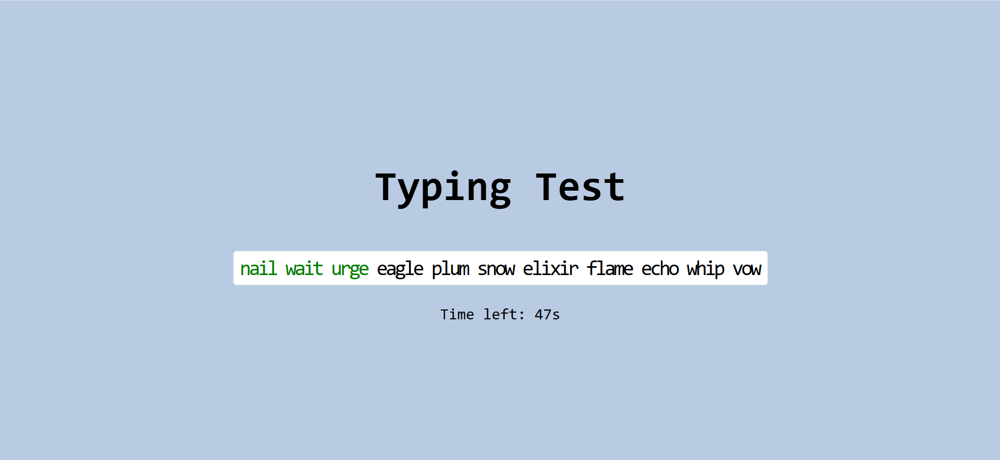

# ⌨️ Typing Test

A modern, interactive typing speed test application built with vanilla JavaScript, HTML, and CSS. Test your typing speed and accuracy with a 60-second challenge!



## 🚀 Live Demo

[View Live Demo](https://lambrugeorge.github.io/Typing-Test/)

## ✨ Features

- **60-Second Timer**: Challenge yourself with a timed typing test
- **Real-time Feedback**: See your typing accuracy with color-coded characters
  - 🟢 Green for correct characters
  - 🔴 Red for incorrect characters
- **WPM Calculation**: Get your Words Per Minute score with error adjustment
- **Dynamic Text Generation**: Randomized word sequences for varied practice
- **Auto-scrolling**: Text container scrolls automatically as you type
- **Mobile Detection**: Shows appropriate message for mobile users
- **Reset Functionality**: Try again button to restart the test
- **Clean UI**: Modern, minimalist design with monospace font

## 🛠️ Technologies Used

- **HTML5**: Semantic markup and structure
- **CSS3**: Modern styling with flexbox and responsive design
- **Vanilla JavaScript**: No frameworks, pure JavaScript functionality
- **JSON**: Word database for typing content

## 📁 Project Structure

```
Typing Test/
├── index.html          # Main HTML structure
├── script.js           # Core JavaScript functionality
├── style.css           # Styling and layout
├── words.json          # Word database
├── typing.png          # Project screenshot
├── package.json        # Dependencies
└── README.md           # Project documentation
```

## 🎯 How It Works

1. **Text Generation**: The app shuffles a collection of words and combines them into a continuous text
2. **Timer System**: A 60-second countdown starts when you begin typing
3. **Character Tracking**: Each keystroke is compared against the target text
4. **Visual Feedback**: Characters are highlighted in real-time (green/red)
5. **WPM Calculation**: Final score is calculated based on words typed minus errors
6. **Auto-scroll**: Text container scrolls horizontally after 20 characters

## 🚀 Getting Started

## 🎮 How to Use

1. **Start Typing**: Click in the text area and begin typing the displayed text
2. **Follow the Text**: Type exactly as shown, character by character
3. **Watch the Timer**: You have 60 seconds to type as much as possible
4. **See Your Score**: After time expires, view your WPM (Words Per Minute) score
5. **Try Again**: Click "Try Again" to restart with new random text

## 📊 Scoring System

- **WPM Calculation**: Based on words typed in 60 seconds
- **Error Penalty**: Each incorrect character reduces your final score
- **Accuracy Focus**: The system encourages both speed and accuracy

### Key Functions

- `shuffleArray()`: Randomizes word order
- `generateLongText()`: Creates continuous text from shuffled words
- `startTimer()`: Initiates 60-second countdown
- `calculateWPM()`: Computes final typing speed
- `isMobileDevice()`: Detects mobile browsers
- `resetTest()`: Restarts the application
